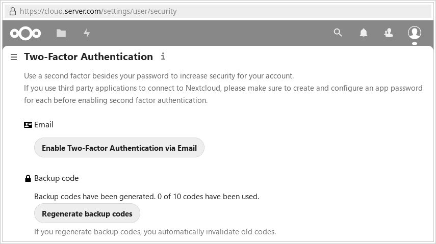
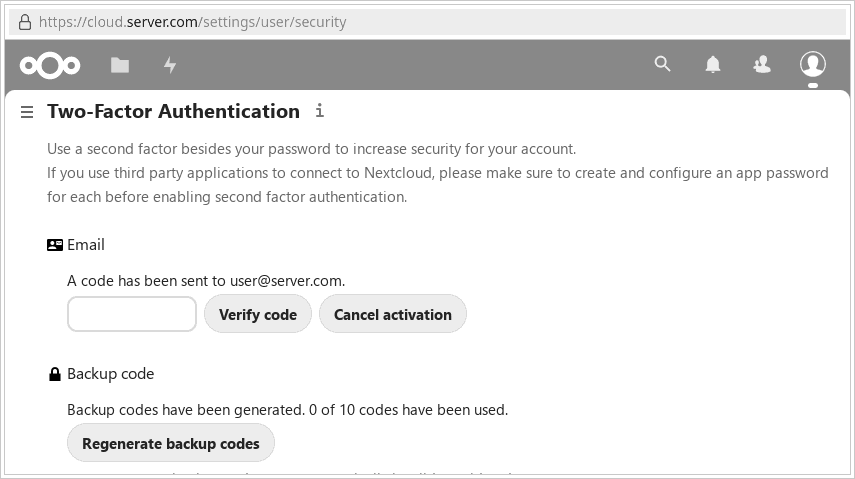

# Two Factor e-mail

This two factor authentication provider creates 6-digit random authentication codes and sends them to the user's primary email address.

Currently this app must be installed by an admin and must be enabled by the user. It might be enhanced to enable admins to enforce 2FA via email for new (and existing?) users.

It currently uses the primary email address set in 'Personal info' and cannot be activated if none is set there. There is an issue that argues that using the primary notification address poses a security risk (to be discussed).

It currently cannot be used on first login when two-factor authentication is enforced (not implemented yet).

Any pull requests or offers to help are welcome, please contact the maintainer (see [wiki](https://github.com/datenschutz-individuell/twofactor_email/wiki/Developer-notes)).

The easiest way to install this app is to select "Apps" from the menu (as admin) and search for "two", then install it (which will retrieve it from the [App Store](https://apps.nextcloud.com/apps/twofactor_email)).

## Enabling e-mail 2FA for your account

## Login with external apps
Once you enable OTP with Two Factor Totp, your applications (for example your Android app or your GNOME app) will need to login using device passwords. To manage it, [know more here](https://docs.nextcloud.com/server/stable/user_manual/en/session_management.html#managing-devices)

## Development setup

* `composer update`
* `composer i`
* `npm install`
* `npm ci`
* `npm run build` or `npm run dev` [more info](https://docs.nextcloud.com/server/latest/developer_manual/digging_deeper/npm.html)
