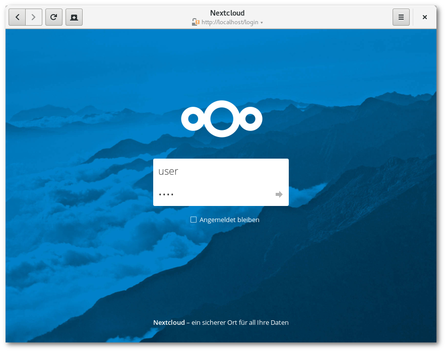
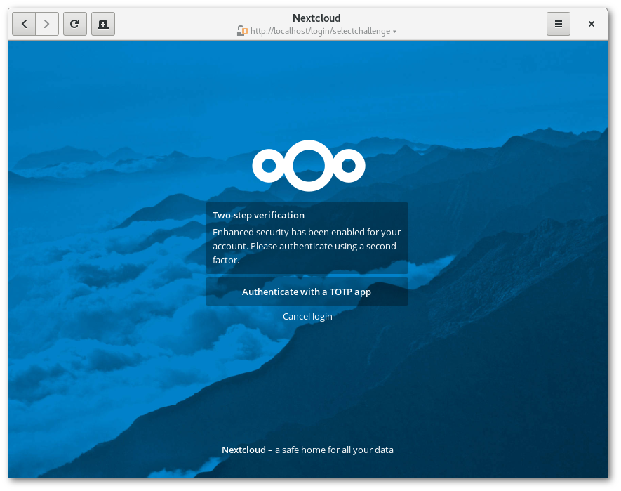
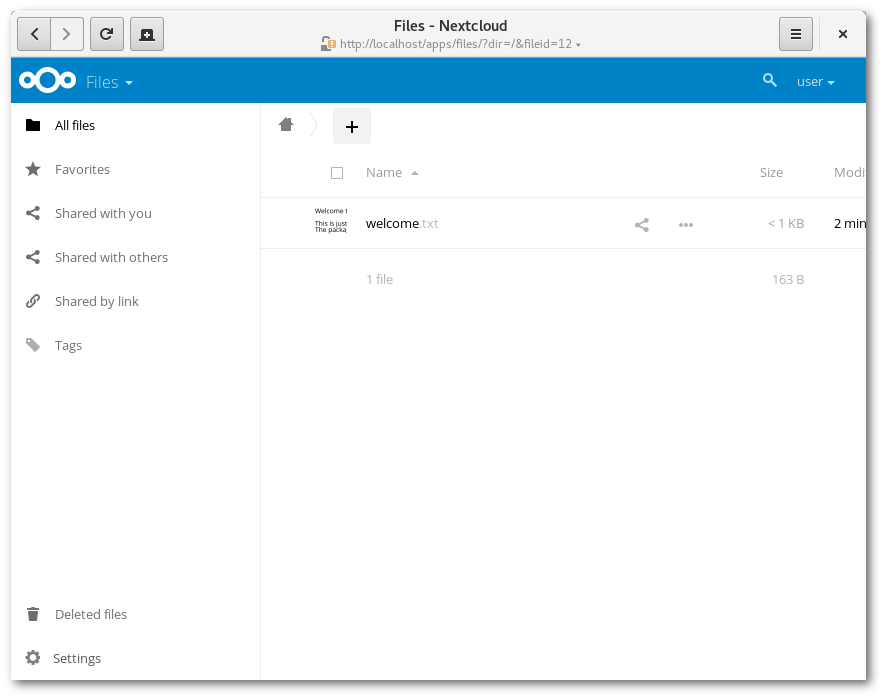

# Two Factor Totp

Tested with the following apps:
* [OTP Authenticator](https://github.com/0xbb/otp-authenticator) (open source) which can be downloaded from [F-Droid](https://f-droid.org/repository/browse/?fdfilter=totp&fdid=net.bierbaumer.otp_authenticator) and has a built-in QR-code reader.
* [Google Authenticator](https://play.google.com/store/apps/details?id=com.google.android.apps.authenticator2) (proprietary)

## Enabling TOTP 2FA for your account

