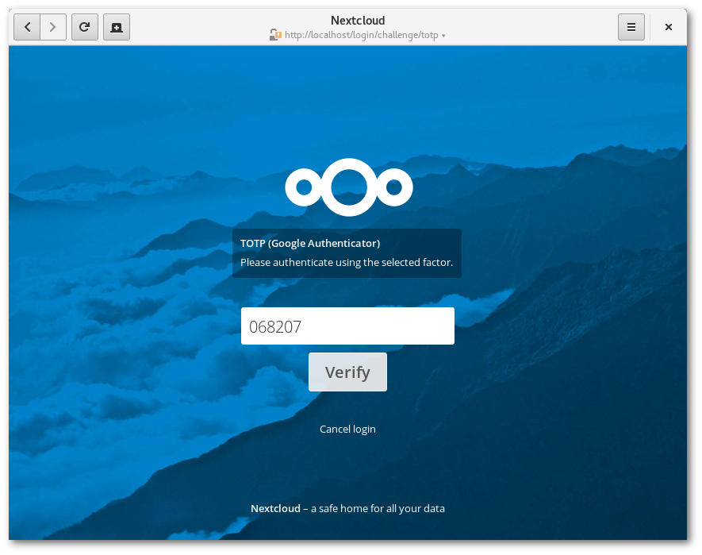
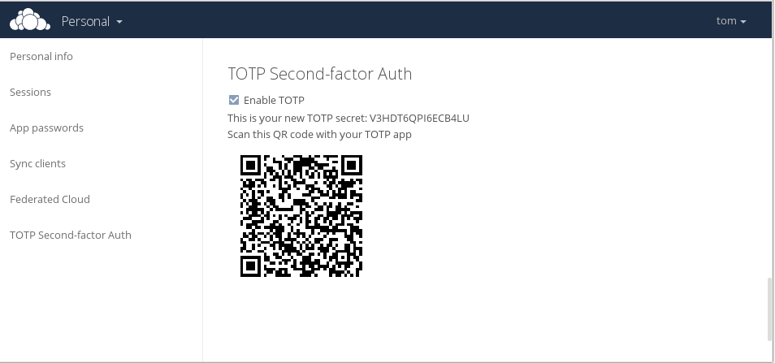

<!--
  - SPDX-FileCopyrightText: 2016 Nextcloud GmbH and Nextcloud contributors
  - SPDX-License-Identifier: AGPL-3.0-or-later
-->
# Two Factor Totp

Tested with the following apps:
* [Aegis](https://github.com/beemdevelopment/Aegis) (open source) Available via [F-Droid](https://f-droid.org/en/packages/com.beemdevelopment.aegis/) and [Google Play](https://play.google.com/store/apps/details?id=com.beemdevelopment.aegis). It features a built-in QR-code reader.
* [FreeOTPPlus](https://github.com/helloworld1/FreeOTPPlus/) (open source) Available via [F-droid](https://f-droid.org/packages/org.liberty.android.freeotpplus/) and [Google Play](https://play.google.com/store/apps/details?id=org.liberty.android.freeotpplus).
* [OTP Authenticator](https://github.com/0xbb/otp-authenticator) (open source) Available via [F-Droid](https://f-droid.org/en/packages/net.bierbaumer.otp_authenticator/) and [Google Play](https://play.google.com/store/apps/details?id=net.bierbaumer.otp_authenticator). It features a built-in QR-code reader.
* [Google Authenticator](https://play.google.com/store/apps/details?id=com.google.android.apps.authenticator2) (proprietary)
* [KeePassXC (Linux, Windows, macOS)](https://keepassxc.org/) (open-source) Available via [download](https://keepassxc.org/download/), package repositories or [GitHub](http://www.github.com/keepassxreboot/keepassxc/) (Keepass also provides a plugin and Keepass2Android allows you to use a TOTP token)
* [SailOTP (SailfishOS)](https://github.com/seiichiro0185/sailotp) (open source) Available via JollaStore or [Openrepos.net](https://openrepos.net/content/seiichiro0185/sailotp)
* [OTP Auth](https://cooperrs.de/otpauth.html) (proprietary) Available via [Apple's App Store](https://itunes.apple.com/us/app/otp-auth/id659877384)
* [Authy (Twilio Authy)](https://authy.com/) (proprietary) for Android and IOS. Available via [Google Play](https://play.google.com/store/apps/details?id=com.authy.authy) and [Apple's App Store](https://apps.apple.com/de/app/twilio-authy/id494168017)

Tested with the following hardware devices:
* [Nitrokey Pro](https://shop.nitrokey.com/shop/product/nitrokey-pro-2-3)
* [Nitrokey Storage](https://shop.nitrokey.com/shop)

## Installation

### Nextcloud 25 and newer

The app is [shipped](https://docs.nextcloud.com/server/latest/developer_manual/app_publishing_maintenance/release_process.html#shipped-apps) and comes with the installation of Nextcloud Server. No additional steps are necessary, besides activating it.

### Nextcloud 24 and older

The app is available through the [app store](https://apps.nextcloud.com/apps/twofactor_totp). It can be [installed through Nextcloud's app management UI](https://docs.nextcloud.com/server/latest/admin_manual/apps_management.html#managing-apps).

## Enabling TOTP 2FA for your account

## Login with external apps
Once you enable OTP with Two Factor Totp, your applications (for example your Android app or your GNOME app) will need to login using device passwords. To manage it, [know more here](https://docs.nextcloud.com/server/stable/user_manual/en/session_management.html#managing-devices)

## Development setup

* `composer i`
* `npm ci`
* `npm run build` or `npm run dev` [more info](https://docs.nextcloud.com/server/latest/developer_manual/digging_deeper/npm.html)
